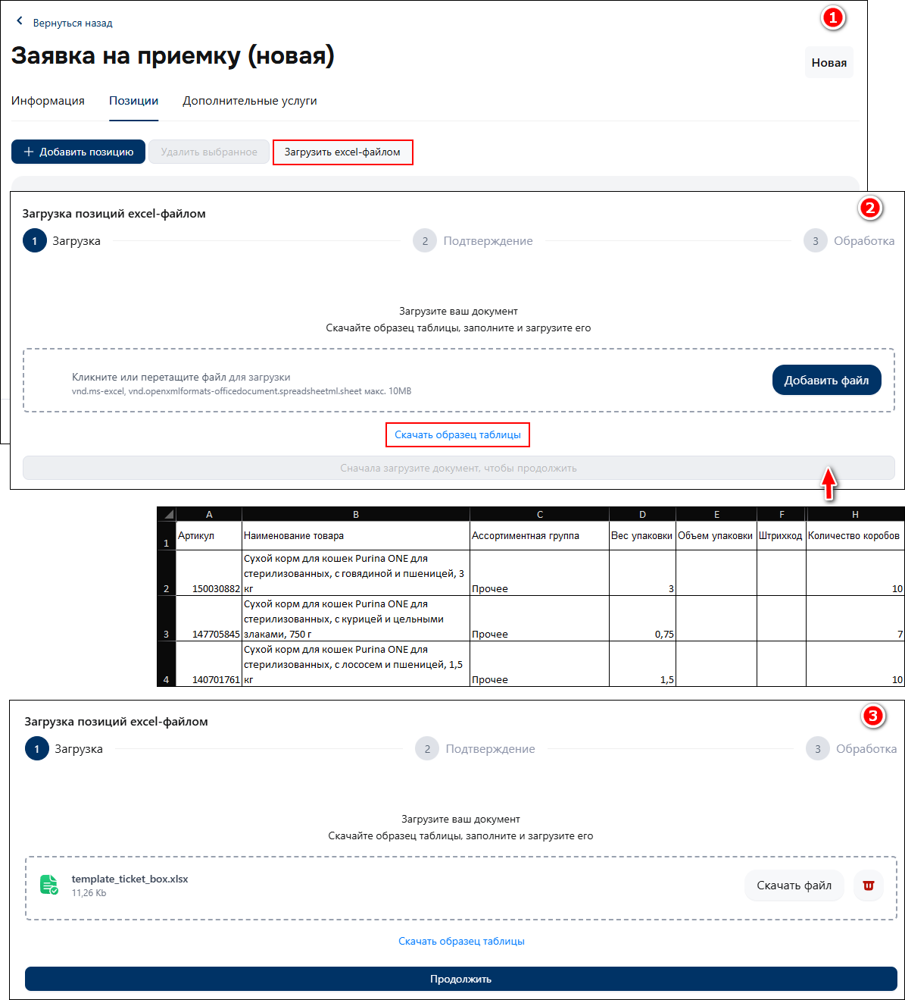

<head>
<!-- Google tag (gtag.js) -->

<!-- Yandex.Metrika counter -->

<noscript>

</noscript>
<!-- /Yandex.Metrika counter -->
</head>

# Формирование номенклатуры

Добавление в заявку номенклатуры возможно как вручную **отдельными артикулами**, так и **общим списком позиций** через загрузку *Excel*-файла.

## Добавление отдельных позиций номенклатуры

1. На вкладке «*Позиции*» нажмите кнопку «*Добавить позицию*».
2. В диалоговом окне на вкладке «*Создание позиции*» заполните требуемые реквизиты артикула :material-arrow-right-thin: нажмите кнопку «*Добавить позицию*».
3. На форме выбора позиций в заявку добавьте требуемые артикулы в номенклатуру <small>(установить галку рядом с артикулом)</small> :material-arrow-right-thin: нажмите кнопку «*Подтвердить выбор*».

    <figure markdown="span">
        { width="400" }
        <figcaption><small>Добавление отдельных позиций номенклатуры</small></figcaption>
    </figure>

## Загрузка номенклатуры через *Excel*-файл

1. На вкладке «*Позиции*» нажмите кнопку «*Загрузить excel-файлом*».
2. Добавьте предварительно заполненный *Excel*-файл через форму загрузки.  
`Excel-шаблон доступен для скачивания по ссылке «Скачать образец таблицы» в диалоговом окне.`
3. Нажмите «*Продолжить*».

    <figure markdown="span">
        { width="400" }
        <figcaption><small>Загрузка номенклатуры через Excel-файл (1)</small></figcaption>
    </figure>

4. Ознакомьтесь с загруженными данными на форме предварительного просмотра :material-arrow-right-thin: нажмите кнопку «*Добавить в заявку*».
5. На форме выбора позиций в заявку добавьте требуемые артикулы в номенклатуру <small>(установить галку рядом с артикулом)</small> :material-arrow-right-thin: нажмите кнопку «*Сохранить*».

    <figure markdown="span">
        { width="400" }
        <figcaption><small>Загрузка номенклатуры через Excel-файл (2)</small></figcaption>
    </figure>

!!! warning ""

    :material-alert-circle-outline: **ОБРАТИТЕ ВНИМАНИЕ**  
    При загрузке номенклатуры через *Excel*-файл, *ранее созданные позиции с аналогичными артикулами* – *повторно не загрузятся*.  
    Вы можете их выбрать на форме выбора позиций в заявку.        
